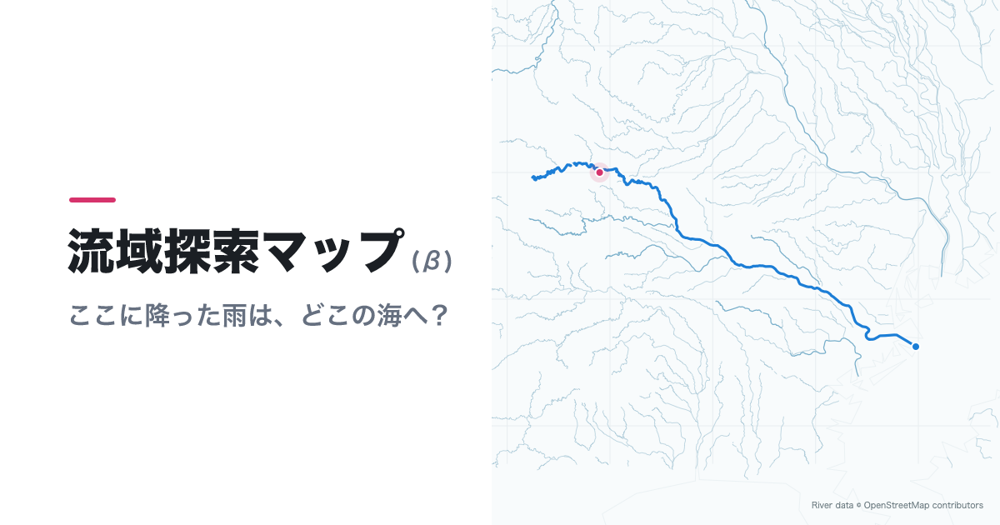
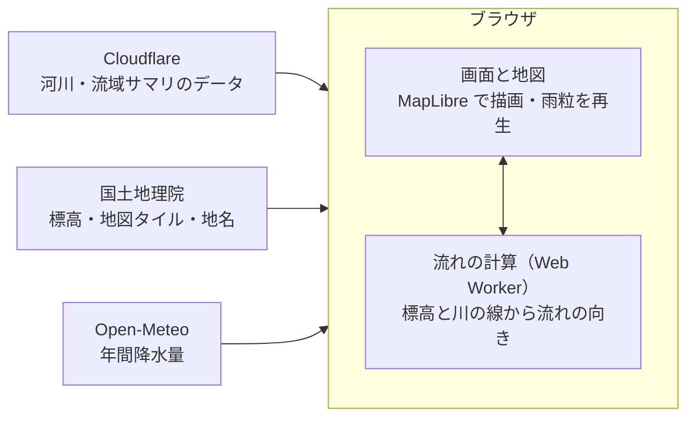
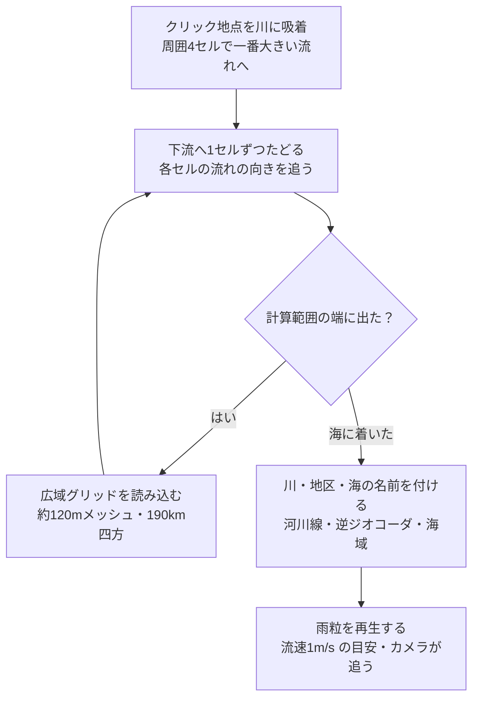
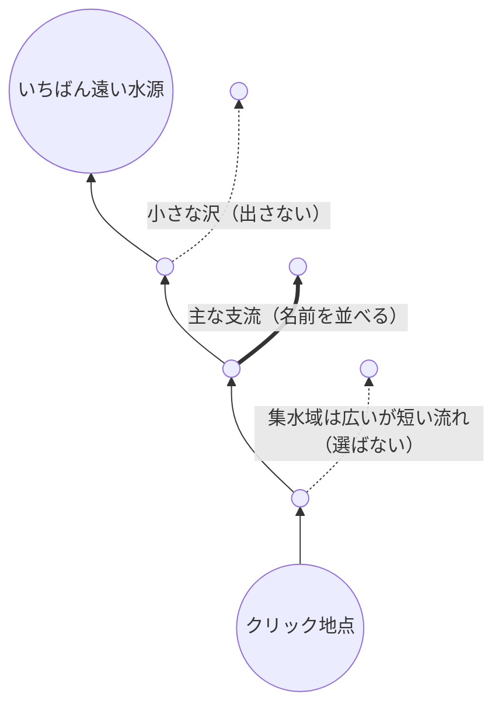
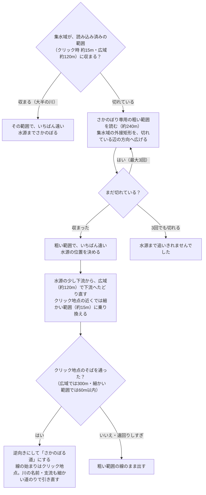

# 流域探索マップ(β)

**https://ryuiki-map.ykns.workers.dev/**

[](https://ryuiki-map.ykns.workers.dev/)

ある地点に降った雨が、どの川と集落を通って海へ向かうかをたどれる探索マップ。日本全国に対応。地点をクリックすると雨粒が川を下り、合流する川・通過するダムと堰・通過する地区（大字）が時系列に並ぶ。`?p=経度,緯度` 付きの URL を開くと、その地点の水の流れを再生する（`&dir=up` も付いていれば、下る動きは見せずに水源へさかのぼる）。

雨が着いたら「上流へさかのぼる」で、その地点の水がどこから来たか（通る川・流れ込む主な支流・地区・水源）をたどれる。「流域サマリを見る」で、海までの距離と通り道の土地の使われ方、およびその地点より上流（集水域）の面積・標高・人口の推移・年間降水量・ダムと堰・川を1枚にまとめて出す。

キーボードだけでも使える: Tab で地図を選ぶと照準が出て、矢印キーで移動、+/- で拡大・縮小、Enter で照準の位置に降った雨の流れをたどる。

## 参加する

不具合の報告や「この地点の流れがおかしい」「こんな使い方をしたい」といった提案は [Issue](https://github.com/yokinist/ryuiki-map/issues) へ。Pull Request も歓迎します。報告・開発のしかたと決まりは [CONTRIBUTING.md](CONTRIBUTING.md) にまとめています。

## 開発

```sh
pnpm install
pnpm dev
```

河川データ（`public/rivers/`）と流域サマリ用のデータ（`public/karte/`）は生成済みのものがリポジトリに入っているので、データを作らずにそのまま動く。

データの作り直しは、全国分を取り直すときだけ行う（公開 API に長時間問い合わせる）。スクリプトは手元のキャッシュ（`.cache/`、git 管理外）にある分だけで全体を作り直すので、クローン直後に一部のタイルやメッシュだけ取ると、ほかの地域のデータが消える。消えたら `git restore public/rivers public/karte` で戻せる。

```sh
pnpm build:rivers       # 全国の河川線を OpenStreetMap（Overpass API）から取り直す（40〜60分）
pnpm build:karte        # 流域サマリ用の人口・土地・ダムのデータを作り直す（約1時間）
```

| コマンド | 内容 |
| --- | --- |
| `pnpm test` | ユニットテスト（Vitest） |
| `pnpm typecheck` | 型チェック |
| `pnpm test:e2e` | ブラウザ（Playwright・Chromium）で代表地点の結果と上り下りの切り替えを確かめる。国土地理院から標高タイルを取るので数分かかる。初回は `pnpm exec playwright install chromium`。`BASE_URL=https://…` を付けると本番や PR のプレビューに対して走る。CI では対象のファイルが変わった PR で、PR のプレビュー URL に対して走る |
| `pnpm check` / `pnpm format` | Lint・整形（Biome） |
| `pnpm build:rivers [タイル…\|--pack]` | 河川データの取得と配信用タイルへの変換。引数なしなら全国のうち未取得の1°タイルだけ取る（途中から再開できる）。`139_36` のように指定するとそれだけ取り直す。どちらも変換は取得済みの全タイルで行う。`--pack` は取得せず変換だけやり直す |
| `pnpm build:karte [1次メッシュ…\|--pack]` | 流域サマリ用のデータ。e-Stat の国勢調査1kmメッシュ（2010・2015・2020年の人口）、ESA WorldCover（土地の使われ方）、OSM のダム・堰を取得し、1次メッシュ（約80km四方）ごとのファイルにまとめる。途中から再開できる。`5339` のように指定するとそれだけ取る。どちらもまとめは取得済みの全メッシュで行う。`--pack` は取得せずまとめ直す |
| `pnpm build:seas` | 河口がどの海かを判定する海域データ（`public/seas.json`、約140KB）を作る。1回きりでよい |
| `pnpm build:og` | 共有時の画像 `public/og.png` を `site.config.ts` の `name`・`stage`・`ogTagline` で描き直す（右の地図は `assets/og-map.png`）。文字は macOS のヒラギノで描く |
| `pnpm build:hill` | 陰影起伏図で海だけのタイル（404 になる）の一覧（`src/client/map/hill-missing.json`）を作る。問い合わせずに済ませてコンソールのエラーを減らす。1回きりでよい |
| `pnpm deploy` | ビルドして Cloudflare Workers へ公開。ふだんは PR を `main` にマージすると GitHub Actions が行う（PR ではプレビューの版を別に出す） |

## しくみ

サーバーはファイルを配るだけで、計算はすべてブラウザの中で行う。地形の読み込みと流れの計算は、画面が固まらないよう Web Worker で動かす。



- Cloudflare は、事前に作った静的ファイル（全国の河川線を0.5°四方に分けたタイル、流域サマリ用の人口・土地・ダム、海域、フォント）を配るだけ
- 標高タイル・地図タイル・逆ジオコーダ（地理院）は、ブラウザが直接取りに行く。Open-Meteo は流域サマリを開いたときだけ1回問い合わせる

### 1. 流れの向きを決める

各セルについて、隣の8方向のどこへ流れるかを1つ決める（D8。`terrain/grid.worker.ts`・`terrain/hydro.ts` の `route`）。

```text
計算用の標高（m）と流れの向き。* はクリック地点、3行目は川の線（焼き込み済み）

 *40   34   27   21   15  -> 海
    ↘    ↘    ↘    ↘
  36   29   22   16   11  -> 海
    ↘    ↘    ↘    ↘
  31 → 12 →  9 →  6 →  3  -> 海    ← 川の線（計算用の標高を下げてある）
    ↗    ↗    ↗    ↗
  38   30   24   19   14  -> 海

クリック地点からの道のり: 40 → 29 → 9 → 6 → 3 → 海（斜面を下って川に入り、川沿いに海へ）
```

1. **標高を読む**：地理院の標高タイル（dem_png）は、PNG の色（RGB）に 0.01m 単位の標高を入れた形式。海は無効値なので空（NaN）にする
2. **川の線を焼き込む**：平野は標高差がほぼなく、標高だけだと流れが隣の川へ逃げる。OSM の河川線が通るセルの計算用の標高を、長い川ほど深く下げる（`10 + 8 × log₂(1 + 長さkm / 10)` m、上限60m。利根川 322km で約50m、沢で10m。`config.ts` の `burnDepth`）。川の長さは OSM の waterway リレーションか、同じ名前でつながった線の合計から求める。表示用の標高は元のまま残す
3. **海と範囲の端から内側へ広げる（Priority-flood、Barnes et al. 2014）**：海に接するセルと範囲の端のセルを出発点に、低い順に隣のセルを取り込み、取り込んだ相手をそのセルの流れ先にする
   - 窪地は縁の高さまで埋められたものとして扱うので、すべての陸のセルが海か範囲の端までの流れを持つ
   - 河口が砂州でふさがっている場所やダム湖の手前では、川筋が埋められて平らになる。その中では元の標高が低いセル（深く焼き込んだ本流）を先に取り込むので、並行する支流に流れが逸れない
   - 最後に上流から順に足し込み、各セルの集水数（自分より上流のセル数）を出す

計算するのは、まだ計算していない場所をクリックしたときのその周り（約25km四方）と、拡大して地図を止め、見えている地図のタイルを読み終えたときの表示範囲（マウス位置からの流れの先読み用。表示中の地図と回線を取り合わないよう後回しにする）。

### 2. クリックから河口まで



- **吸着**：川のすぐ脇をクリックしても斜面の小さな流れから始まらないよう、周囲4セル（約60m）で集水数が最大のセルに寄せる（`snap`）
- **たどる**：流れ先を順に追い、海のセルに着いたら終わり。範囲の端に出たら、読み込み済みの別の範囲か、その先の広域グリッドに乗り換えて続ける（最大8回。`terrain/trace.ts` の `traceToSea`）
- **川の名前**：焼き込むときにセルごとの川も記録しておき、道のりに沿って拾う。今の川が2セル以内に続いていれば、隣の支流に名前を移さない。1km 未満しか沿わない川は合流点のかすりとして捨てる（`data/rivers.ts` の `riversAlong`）
- **地区（大字）**：合流から次の合流までの区間ごとに、地理院の逆ジオコーダに問い合わせる（区間ごとに最大3地点、同時4件。`data/places.ts`）
- **海の名前**：河口の点がどの海域（IHO の海域区分）に入るかで決める。海岸線が粗いので、外れたら20km 以内で一番近い海域にする（`data/seas.ts`）
- **ダム・堰**：流域サマリ用のダム・堰のデータから、流路から約250m以内のものを拾う（名前のない堰は数が多いので除く。`damsNearPath`）

### 3. 上流へさかのぼる

「一番大きい支流」ではなく、クリック地点より上流で**いちばん遠い水源**（流れに沿った長さが最大のセル）まで行く（`terrain/hydro.ts` の `farthestStem`、`terrain/trace.ts` の `traceToSource`）。



- 上流の端から下流へ、「そこから一番遠い水源までの長さ」をセルごとに受け渡し（斜めは √2 セル）、どの隣から来たかを記録しておく。クリック地点からその記録を逆にたどると、いちばん遠い水源に着く。流域サマリの「水源からの長さ」と同じ道のり
- 途中で脇から流れ込む流れのうち、**集水域が5km²以上かつ合流点の本流の10%以上**で名前のあるものを、主な支流として出す（`tributaries`）。小さな沢まで並べると本流が埋もれるため。支流の名前は、合流点では本流の名前が近くにあるので、支流側に約1.5kmさかのぼった区間で引く
- 集水域が10km²未満の地点（小さな水路）は、近くの雨がほとんどだと添える。水源との高低差が30m未満の平地では、川から引いた用水は地形からたどれないことを添える

#### 大きな川：水源を探す範囲と、線の引き直し

いちばん遠い水源を決めるには、集水域全体が1つの範囲に収まっている必要がある（枝の先の先までの長さを比べるため）。下りのように、範囲の端で乗り換えて続けることはできない。そこで、集水域が収まる範囲を選び、必要なら粗い範囲を読み足す。



1. **範囲を選ぶ**：流域サマリと同じく、まずクリック時の範囲、次に読み込み済みの広域グリッド（約190km四方）で集水域を数え、端で切れないものを選ぶ（`data/karte.ts` の `basinAt`）
2. **粗い範囲を読み足す**：どれでも切れる大きな川（北上川・石狩川・利根川・淀川・信濃川など）は、さかのぼり専用の粗い範囲（ズーム9、約240mメッシュ）を読む。形は集水域に合わせ、外接矩形から切れている辺の方向へだけ広げる（最大36枚。`terrain/basin-range.ts` の `widestTiles`）。まだ切れていれば、その辺へ広げて読み直す（最大3回。信濃川は南の千曲川の次に、西の梓川で切れる）。この範囲は下りの乗り換えには使わない（線が粗くなるため）
3. **先に読んでおく**：海に着いて着地の動きが終わったら、集水域が切れていれば、「上流へさかのぼる」を押される前に裏で読み始める（`prefetchBasin`）。集水域を数えるのに数十 ms かかるので、動きを止めないよう着地のあとに回す（`ui/camera.ts` の `landed`）。同じ地点の問い合わせ（先読み・さかのぼり・流域サマリ）は1つの結果を使い回し、二重に読まない。読み直しの回し方は `terrain/basin-widen.ts` の `widenBasin`
4. **線を引き直す**：粗い範囲は水源の**位置**を決めるためだけに使う。尾根にある水源そのものからではなく、粗い道のりで少し下流（粗いセル5つ分）の谷の中から、広域グリッド（約120m）で下流へたどる。クリック地点の細かい範囲（約15m）の十分内側に入ったら、そちらに乗り換える。クリック地点のそば（広域では300m、細かい範囲に乗り換えたあとは60m）を通ったら止め、逆向きにして「さかのぼる道」にする。線の始まりはクリック地点に合わせ、下り始めた点から水源までの短い区間は粗い線を足す（`terrain/trace.ts` の `refineSource`、`terrain/trace-core.ts` の `traceDown`・`reverseToSource`）。そばを通らないとき・粗い道のりより大きく遠回りしたとき（1.5倍＋5km）は、打ち切って粗い範囲の線のまま出す。引き直しの地形を読めなかったときも同じ
5. **地図の塗り**：クリックした直後の塗り（集水域）は雨をたどった範囲の中だけなので、3 の先読みで広い範囲で数え直せたら、海に着いたあと（さかのぼる前）に塗り直す。塗りと流域サマリの面積は、同じ範囲になる

距離と面積は、セルごとの緯度で測る。Web メルカトルのセルは緯度 φ で赤道の cos φ 倍になり、南北に長い範囲では、中央の緯度で固定すると数%ずれるため（`terrain/grid-spec.ts` の `rowM`）。

### 4. 流域サマリ

1. 流れの向きを逆にたどり、クリック地点に流れ込むセル全部に印を付ける。これが集水域（`terrain/hydro.ts` の `upstream`）
2. 各セルが入る1kmメッシュ（JIS X 0410 の3次メッシュ）ごとに、集水域に入る面積を出す
3. メッシュの人口を入る面積の割合で按分し、土地の使われ方を面積で重み付けして合計する（`data/karte.ts`・`data/karte-stats.ts`）

- 長さは、クリック地点から河口までの雨の通り道の距離（パネルの距離と同じ）。添えて、範囲の中でいちばん遠い水源からクリック地点までを流向（`down`）に沿ってたどった距離（`longestFlowKm`）も出す
- 範囲の選び方は、上流へさかのぼるときと同じ（上の「大きな川」の1〜3）。それでも端に届くなら「端で切れている」と表示する。面積はセルごとの緯度で測る
- 年間降水量は、範囲の中心1地点について Open-Meteo（ERA5 再解析）の1991〜2020年の日降水量を平均する

### 主な数字

| 項目 | 値 |
| --- | --- |
| クリック時に読む範囲 | 標高タイル ズーム13 を縦横6枚、約25km四方（1セル約15m） |
| 広域グリッド | ズーム10 を縦横6枚、約190km四方（1セル約120m） |
| さかのぼり専用の粗い範囲 | ズーム9 のタイル最大36枚（1セル約240m）。集水域の外接矩形から、切れている辺の方向へだけ広げる（1つの軸は最大8枚、約450km）。まだ切れていれば、その辺へ広げて読み直す（最大3回）。集水域が広域グリッドに収まらない大きな川だけで、海に着いて着地の動きが終わったら、裏で先に読む（「上流へさかのぼる」・流域サマリも同じ結果を使う） |
| さかのぼる線の引き直し | 水源から粗いセル5つ分（約1.2km）下流から下り直す。クリック地点の300m以内（細かい範囲に乗り換えたあとは60m以内）を通ったら着いたとみなす。粗い道のりの1.5倍＋5km を超えて下ったら打ち切る |
| 地図を止めたときの先読み | ズーム10以上で、表示範囲を裏で計算 |
| 川の焼き込みの深さ | 10〜60m（長い川ほど深い） |
| クリックの吸着 | 周囲4セル（約60m） |
| 流下時間の目安 | 一律 1m/s |
| 主な支流の条件 | 集水域5km²以上、かつ合流点の本流の10%以上 |
| ダム・堰を拾う範囲 | 流路から約250m以内 |

平地・市街地・用水路のある場所では、標高の差が小さく、人がつくった水路は地形に現れないので、実際の流れと外れることがある。

## 構成

```
src/client/              ページ（ブラウザ側）
  main.ts                起動・地図・操作のつなぎ込み
  config.ts              起動時の表示範囲・計算範囲・データの URL などの設定
  geo.ts                 経緯度・範囲の型と小さな関数
  terrain/               地形と水の流れの計算
    grid-spec.ts         計算グリッドの定義（標高タイルの並びに合わせる）
    dem.ts               地理院の標高タイルの読み込み
    hydro.ts             流向・集水域の計算（純粋関数）
    grid.worker.ts       グリッドづくり（標高・河川の読み込み、焼き込み、流向計算）を行う Web Worker
    grid.ts              Worker の呼び出しと、読み込み済みグリッドの管理
    trace.ts             河口までの流路（グリッドの端では隣のグリッドに乗り換える）と、水源までさかのぼる道のり
  data/                  外部データ
    rivers.ts            河川の表示・焼き込み・名前の参照
    river-format.ts      配信用の河川タイルの形式（scripts と共有）
    places.ts            地名（地理院の逆ジオコーダ）
    seas.ts              河口がどの海か
    karte.ts             流域サマリの集計（範囲の数え直し・メッシュデータの読み込み・降水量の問い合わせ）
    karte-stats.ts       流域サマリの計算（按分・割合。純粋関数）
    karte-format.ts      流域サマリのデータ形式と地域メッシュの計算（scripts と共有）
  map/                   地図の描画
    overlays.ts          地図に重ねるレイヤーと画像
    theme.ts             CSS のデザイントークンを地図の描画色に使う
    hill.ts              陰影起伏図のタイルを、海だけのタイルを飛ばして読む
    sea-tiles.ts         海だけのタイルの一覧（hill-missing.json）の引き方
  ui/                    画面
    rain.ts              雨粒の再生と、時系列・まとめ・上流へのさかのぼりの表示
    karte.ts             流域サマリの画面（カードを並べて比べる）
    camera.ts            雨粒を追うカメラ
    layout.ts            パネルに隠れない地図の範囲の計算
    motion.ts            雨粒の進め方（イージング・再生時間）
    timeline.ts          時系列の部品
    dom.ts               DOM ヘルパー
    format.ts            距離・時間・面積の表示形式
  styles/                tokens.css（デザイントークン）と app.css
scripts/                 データの作成（河川: build-rivers.ts、流域サマリ: build-karte.ts、海域: build-seas.ts、陰影の欠けタイル: build-hill-index.ts、共有時の画像: build-og.ts、Overpass API の問い合わせ: overpass.ts）
assets/                  配信しない素材（共有時の画像の右側の地図 og-map.png）
public/                  静的ファイル（seas.json、_headers、地図の欧文フォント fonts/、アイコン・OGP 画像。河川タイル rivers/ と流域サマリ karte/ は生成物だが git で管理する）
site.config.ts           サイト名・説明・URL・構造化データ。index.html の {{キー}} に差し込む
site.files.ts            robots.txt・sitemap.xml・llms.txt（AI 向けのサイト説明）。ビルド時に書き出す
wrangler.jsonc           Cloudflare Workers の設定。静的アセットを配るだけで Worker のコードは持たない
.github/                 CI（型チェック・Lint・テスト・ビルド）、PR の自動レビュー、Issue・PR のひな形
```

テストは対象ファイルの隣に `*.test.ts` として置く。

色・文字サイズ・余白は `src/client/styles/tokens.css` だけで定義し、地図の描画色もそこから読む。

## 出典・ライセンス

ソースコードは [MIT License](LICENSE)。地図データは以下のとおりそれぞれ別のライセンスで、MIT は適用されない（リポジトリに入っている `public/rivers/`・`public/karte/` も、各フォルダの `README.txt` のライセンスに従う。詳しくは [NOTICE.md](NOTICE.md)）。

- [地理院タイル](https://maps.gsi.go.jp/development/ichiran.html)（白地図・淡色地図・陰影起伏図・標高タイル）、地理院 逆ジオコーダ（国土地理院）
- 河川線と名前: [© OpenStreetMap contributors](https://www.openstreetmap.org/copyright)（[ODbL 1.0](https://opendatacommons.org/licenses/odbl/1-0/)）
- 海域: Flanders Marine Institute (2018). IHO Sea Areas, version 3（[Marine Regions](https://www.marineregions.org/)、CC BY 4.0）。日本周辺で切り抜き・簡略化して `public/seas.json` にしている（`pnpm build:seas`）
- 流域サマリの人口: 「国勢調査」2010・2015・2020年 3次メッシュ（1kmメッシュ）人口総数（総務省統計局、[e-Stat](https://www.e-stat.go.jp/gis)）。[政府標準利用規約（第2.0版）](https://www.e-stat.go.jp/terms-of-use)に基づき加工して利用（秘匿値は0として集計）
- 流域サマリの土地の使われ方: © ESA WorldCover project 2021 / Contains modified Copernicus Sentinel data (2021) processed by ESA WorldCover consortium（[ESA WorldCover](https://esa-worldcover.org/)、CC BY 4.0）。約70mに縮小した版から1kmメッシュごとの分類の割合にしている
- 流域サマリの年間降水量: [Weather data by Open-Meteo.com](https://open-meteo.com/)（CC BY 4.0。Copernicus Climate Change Service の ERA5 を含む）。表示のたびにブラウザから問い合わせる
- ダム・堰（流域サマリ・雨の通り道）: [© OpenStreetMap contributors](https://www.openstreetmap.org/copyright)（ODbL 1.0）。ライセンスの違うデータを同じファイルに混ぜないよう、流域サマリのデータ（`public/karte/<版>/`）は人口・土地（`meshes/`）と OSM 由来のダム・堰（`dams/`、ODbL）に分け、それぞれに出典とライセンスを書いた `README.txt` を添えて配信する

### 利用条件を満たしている根拠

| 対象 | ライセンス・規約 | 求められること | このアプリでの対応 |
|---|---|---|---|
| 地理院タイル（白地図・淡色地図・陰影起伏図・標高タイル） | [国土地理院コンテンツ利用規約](https://www.gsi.go.jp/kikakuchousei/kikakuchousei40182.html) | 出典の明示（申請不要） | 地図右下に「地理院タイル」を一覧ページへのリンク付きで表示（`config.ts` の `ATTRIBUTION.gsi`）。アプリ内の「出典・ライセンス」にも記載 |
| 地理院 逆ジオコーダ | 同上 | 出典の明示 | 地図右下とアプリ内に記載。問い合わせ数は「外部サービスへの配慮」のとおり絞っている |
| OSM の河川線・名前 | ODbL 1.0 | ①出典表示 ②派生データベースを同じ ODbL で提供 | ①地図右下に「© OpenStreetMap contributors」を著作権ページへのリンク付きで表示（`ATTRIBUTION.rivers`）。OG 画像にも記載 ②変換したタイルを `/rivers/` で公開し、出典・ライセンス・加工内容を書いた `/rivers/README.txt` を添える |
| OSM のダム・堰 | ODbL 1.0 | 同上 | ①同上 ②`/karte/<版>/dams/` に分けて公開し、`dams/README.txt` を添える。ODbL 以外のデータと同じファイルに混ぜない |
| 国勢調査 1kmメッシュ人口（e-Stat） | [政府標準利用規約（第2.0版）](https://www.e-stat.go.jp/terms-of-use)（CC BY 4.0 互換） | 出典の記載と、加工した旨の明示 | アプリ内と `/karte/<版>/meshes/README.txt` に「出典：政府統計の総合窓口(e-Stat)」「〜を加工して作成」と記載 |
| ESA WorldCover | CC BY 4.0 | 所定の出典文言と、改変した旨 | 所定の文言（© ESA WorldCover project 2021 / Contains modified Copernicus Sentinel data…）をアプリ内と `meshes/README.txt` に記載し、1kmメッシュに集計した旨も書いている |
| IHO Sea Areas（Marine Regions） | CC BY 4.0 | 出典表示と、改変した旨 | アプリ内に出典と「日本周辺で切り抜き・簡略化して使用」を記載（`/seas.json`） |
| Open-Meteo の降水量 | CC BY 4.0。無料 API は非商用のみ | 出典表示。商用なら有料プラン | アプリ内に「Weather data by Open-Meteo.com」をリンク付きで記載。広告・課金のない非商用のアプリ |
| MapLibre GL JS | BSD-3-Clause | ビルド済みで再配布するときは著作権表示とライセンス文を添える | ビルドで同梱ライブラリのライセンス文を `/licenses.md` に書き出し（`vite.config.ts` の `build.license`）、アプリ内からリンク |
| 欧文フォント（Open Sans Semibold） | Apache License 2.0（[openmaptiles/fonts](https://github.com/openmaptiles/fonts)） | 再配布するならライセンス文を添える | 地図の文字用に変換した版（[maplibre/demotiles](https://github.com/maplibre/demotiles)）を `/fonts/` で配信し、ライセンス文 `/fonts/Open Sans Semibold/LICENSE.txt` を添える |
| OG 画像の文字（ヒラギノ角ゴシック） | macOS 同梱フォント | 画像にした文字はフォントの再配布にあたらない | 画像として描いただけで、フォントファイルは含めていない |
| 開発用ツール（Vite・Biome・Vitest・wrangler・geotiff など） | MIT など | — | 配信物に含まれない（`dist/licenses.md` に出てこない） |

アクセス数は [Cloudflare Web Analytics](https://www.cloudflare.com/web-analytics/) で集計している。クッキーを使わず、個人を特定しない範囲（画面ごとの表示数・参照元・国・表示速度）だけを取る。計測タグは `site.config.ts` の `analyticsToken` があるときだけ、ビルドで `index.html` に入る（開発サーバーでは入らない）。PR のプレビューも同じビルドなので、ページを開いたホストが本番（`site.config.ts` の `url`）のときだけ計測を読み込む。アプリ内の「利用上の注意」と `/llms.txt` にも書いている。

ページは1枚だけなので、画面はダッシュボードのパスで分ける。`/` は開いた回数（地図）、`/down` は雨の通り道、`/up` は水の来た道を見始めた回数。beacon は URL の書き換えを1回の表示と数えるので、地図を動かすたびの書き換え（`replaceState`・`#`）は beacon に届く前に止め、`main.ts` が知らせる画面の切り替えだけを仮のパスとして渡している（`vite.config.ts` の `siteConfig`）。検索部分（`?p=`）と `#` は beacon が消してから送るので、クリックした地点は送られない。Navigation API のないブラウザでは `/` だけを数える。

ライセンス違反ではないが、変わりうる前提:

- **Open-Meteo**: 無料で使えるのは非商用の間だけ。広告を載せるなど商用にするなら有料プランに切り替える
- **河川データの商用利用**: 河川線の多くは国土数値情報（現在の使用許諾条件は「非商用」）に由来する。広告を載せるなど商用にするなら、先に国土交通省（国土政策局 国土情報課）に確認する
- **地理院の逆ジオコーダ**: 地理院地図の内部で使われているもので、仕様が文書化された公開 API ではない。予告なく変わることがある

日本の河川線の多くは「国土数値情報（河川データ）」2006年度版（国土交通省）を OSM に取り込んだもの。経緯は次のとおり（[OSM Wiki: Japan KSJ2 Import](https://wiki.openstreetmap.org/wiki/JA:Import/Catalogue/Japan_KSJ2_Import)、[talk-ja 2015年7月](https://lists.openstreetmap.org/pipermail/talk-ja/2015-July/009000.html)）。

| 時期 | 出来事 |
| --- | --- |
| 2010〜2011年 | 河川データを OSM に取り込み |
| 2012年7月 | OSMFJ の照会に、国土交通省 国土政策局が「OSM への国土数値情報データのインポート利用について問題はありません」と回答 |
| 2015年 | 国土数値情報の利用約款の改定で、第三者への再配布の制限と商用利用の原則禁止が明確化。OSM への新たな取り込みは停止され、取り込み済みのデータの扱いは「確認中」とされた（公式な結論は公開されていない） |
| 現在 | 国土数値情報の河川データの使用許諾条件は「非商用」 |

このアプリは、国土数値情報を直接ではなく、2012年の了承のもとで取り込まれた OSM のデータを ODbL のもとで利用しており、非商用なので現在の条件の範囲内と判断している。ただし、取り込み済みのデータに2015年の改定が及ぶかは公式な結論がなく、確定した判断ではない。変換した河川タイル（`public/rivers/`）の `README.txt` とアプリ内の「出典・ライセンス」にも、この経緯を併記している。

外部サービスへの配慮:

- Overpass API（データ作成時のみ）: 1本ずつ・3秒間隔・識別できる User-Agent で問い合わせる。混雑でタイムアウトしたら範囲を分割して取り直す
- 地理院の逆ジオコーダ: 地区名は川の区間（合流から次の合流まで）ごとに1つだけ引く（大字が返るまで最大3地点）。同時4件に絞り、別の地点が選ばれたら未送信の問い合わせは取りやめる（`config.ts` の `GEOCODER`）
- 地理院タイル: ブラウザのキャッシュに任せる。重ね描きは必要な範囲だけ画像にする
- e-Stat（データ作成時のみ）: ファイルを1本ずつ、1秒間隔で取得する
- Open-Meteo: 流域サマリを開いたときだけ1回問い合わせ、同じ地点は覚えておく（無料の API は非商用・1日1万回まで）

データの利用に問題があれば info@yokinist.me までご連絡ください。
